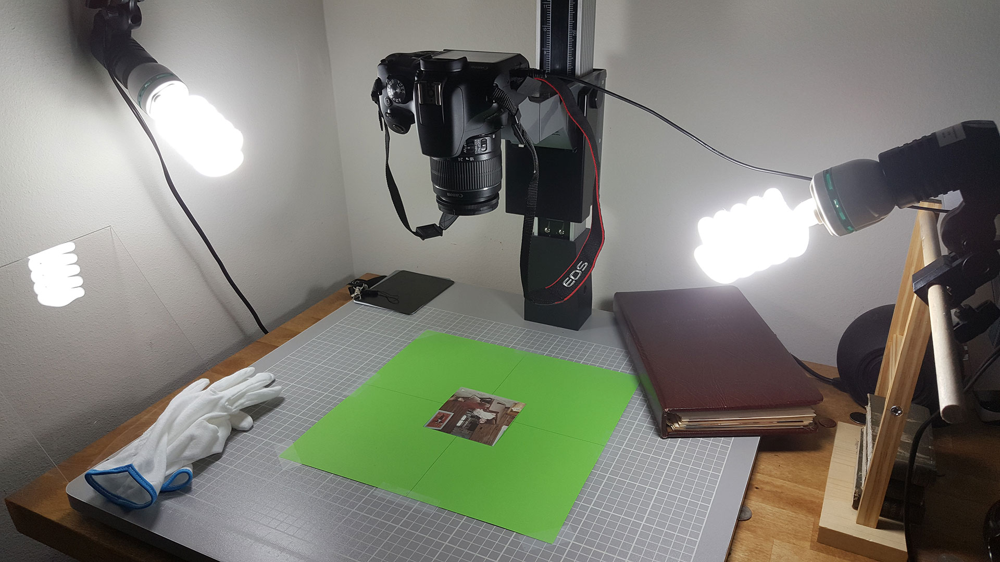

# Forsythe Media Tools

This repository is a collection of custom tools that I've written to help me capture, process, and catalog a large archive of family photos and other printed and audiovisual artifacts.

These command-line tools are currently available:

- `fma orient <directory>`: Displays all images in the given directory to the user, one by one. The user presses an arrow key (up, down, left or right) to indicate which edge of the subject is the top edge: i.e., for a photo shot upside-down the top edge is *down*; for a photo that's already in the correct orientation, the top edge is *up*. Pressing any other key will reverse to allow mistakes to be corrected. Orientation data is saved in `.params/<image_name>.json`.

- `fma crop <directory>`: Uses darktable to regenerate XMP files for all images in the given directory _**(note that this will destroy any prior adjustments made in the darktable GUI)**_, then auto-crops each image, writing the new cropping parameters into the XMP files. In darktable's core options menu, _"look for updated xmp files on startup"_ must be enabled in order to allow XMP reloads.

Functionality for these tools is implemented across several Python modules:

- **forsythe.images**: Organization and file handling for images, including cached conversion from .CR2 RAW to JPEG for intermediate processing

- **forsythe.darktable**: Utilities for working with [darktable](https://www.darktable.org/), an open-source version of Lightroom. Handles launching darktable, clearing and regenerating .XMP sidecar files, and adding image operations to XMPs.

- **forsythe.cropper**: Uses OpenCV to detect the subject (i.e. the physical photo print) in an image captured on a copystand. Assumes a solid-colored background suitable for color keying.

Install Python 3 and pipenv, then run `pipenv install` to create a virtualenv with the prerequisite modules. From there, you can use `fma <command>` to run commands _(or, failing that, `pipenv run python main.py <command>`)_.

This is a hobby project.
